## Geo-Feature

### 描述

在 NUDT 的暑期实习仓库，选题为”数据集的几何特征”。

A repo for summer internship at NUDT, on the topic of "Geometrical Characteristic of Dataset".

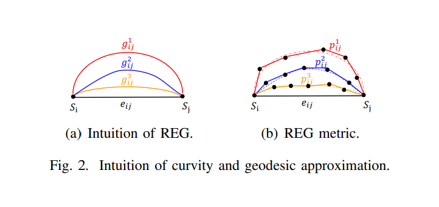

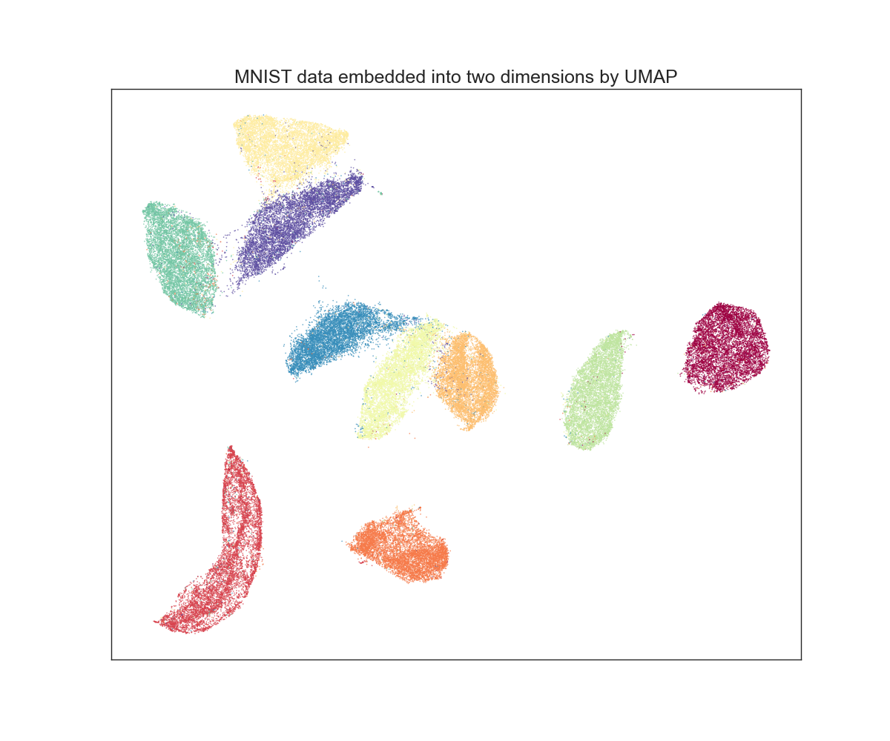

### 环境配置

建议创建conda环境，安装所需python库。

```shell
# conda environment
conda create -n geo python=3.11
conda activate geo
# for /code (based on tensorflow)
pip install -r requirements.txt
# for /hhw_code (based on pytorch)
pip install -r req-hhw_code.txt
# jupyter environment
conda install -n geo ipykernel --update-deps --force-reinstall
```

### 项目结构

- `/code/ `与 `/code_new/`：原始代码code以及简单修改后的代码code_new
- `/hhw_code/`：基于pytorch重构的代码
  - `main.ipynb`：notebook运行测试样例；
  - ~~`run_test.py`：脚本文件运行测试样例；~~
  - `geo.py`：实现数据集几何特征的分析，多进程处理；
  - `utils.py`：通用工具函数；
  - `network.py`：用于图像分类的模型、训练函数；
  - ~~`data_utils.py`：用于数据集处理、加载的相关函数；~~
  - `app_utils.py`：应用数据集几何特征分析的结果，如数据集压缩或增强；
  - `dim_reduce.py`：用于数据降维等预处理；
  - `test_all.py`：用于测试项目中各个函数、网络模型；
  - `datasets/`：数据集自写库
    - `data_utils.py`：仅有 load_data_mnist，暂无用处，下一步调整或删除；
    - `dataset.py`：数据集基类；
    - `mnist.py`：MNIST 数据集类，有待进一步扩充；
  - `results/`：存有数据集几何特征分析的结果，使用pickle存储；
    - `pics/`：训练与测试分类网络时的图片；
    - 其他，暂未列出。

### 运行

#### 提示：

- 由于该算法时间复杂度约为 $O(N^2)$，建议先从较小的数据集尽行测试。
- 且算法得到的中间结果（数据集特征）较大，需要较大内存，i7 16GB 内存 在 $N=10000$ 时堪能运行。

#### 测试平台信息：

##### 软件：

- 支持 Windows 和 Linux 双平台下运行（在数据读取与存储时做了简单的适配）
- CUDA 11.7
- python 3.11
- pytorch 2.0.1

##### 硬件：

```
Processor 11th Gen Intel(R) Core(TM) i7-11800H @ 2.30GHz
Installed RAM 16.0 GB (15.7 GB usable)
System type	64-bit operating system, x64-based processor

NVIDIA GeForce RTX 3050 Laptop
```

#### python 库描述

req-hhw_code.txt：

* `umap-learn`：数据集降维，统一流形逼近和投影降维（UMAP: Uniform Manifold Approximation and Projection for Dimension Reduction）。
* `numpy`：python 科学计算基础软件包，提供多维数组对象（`np.ndarray`）、各种派生对象（如屏蔽数组和矩阵）以及对数组进行快速操作的各种方法。项目中数据处理时主要数据类型为 `numpy.ndarray`。
* `scipy`：Python 科学计算基础算法，项目中用于计算欧氏距离、最短路等，效率很高。
* `scikit-learn`：开源机器学习库，支持监督和非监督学习，提供用于模型拟合、数据预处理、模型选择、模型评估的各种工具以及许多其他实用工具。项目中用于计算 $k$ 近邻距离矩阵。
* `pytorch`：深度学习框架，是一个经过优化的张量库，用于使用 GPU 和 CPU 进行深度学习。项目中用于加载数据集、构建与训练模型。
* `torchvision`：pytorch项目的一部分，由常用数据集、模型架构和计算机视觉常用图像转换组成。项目中用于加载与处理数据集。
* `matplotlib`：用于在 Python 中创建静态、动画和交互式可视化的综合库。用于可视化，也就是绘图。
* `seaborn`：基于 matplotlib 的 Python 数据可视化库。与matplotlib相比，其提供了更高级的封装，能更方便地绘制美观且信息丰富的统计图形。用于可视化，也就是绘图。
* `umap-learn`：UMAP降维库。
* `cProfile`：python 性能分析库。
* `idx2numpy`：从下载的数据集文件中提取。
* `pickle`：存储与加载 Python 对象。

#### 其他

23.8.13

- [X] 编写 `/hhw_code/test.py` 中对 `get_class_geo_feature` 进行测试时发现，计算“平均欧式-测地距离比值” (`ave_egr` 时发现，按论文中描述的计算方法，无需使用 “k-近邻测地线距离” （`geo_dist`），可以极大地化简算法，有待进一步分析确认。
- [X] 需要对算法中间所得的数据进行进一步分析，可视化、分析其分布，从而深入理解算法，产生新想法。
- [ ] 论文中提出用 “骨干路径” （bone_path) 来避免过多地考虑子路径。但在测试时发现， “骨干路径” 非常多，非常短，当选取 200 张 mnist 0 图像，k = 5 时，骨干路径占比超过 80%， 路径长度集中在 5-6 个结点（包括起始和目的结点）。由此感到 “骨干路径” 的特征描述能力较弱，能否提出更强更有效的特征描述指标呢？
- [ ] 分析发现中间数据矩阵稀疏性较高，如何利用稀疏矩阵来更有效地计算和存储数据呢？
- [ ] 对于高维，数值较大，噪音较大的数据，欧氏距离 L2 范数容易受极端值的影响，是否能用其他范数，如 L1 范数？
- [ ] 降维 / 特征提取 后再进行“几何”特征提取？
- [ ] 只考虑局部状态，却要进行全局计算，开销较大，如何解决？
- [ ] 如何分析其他模态的数据？如携带时序信息的文本。

23.8.15

* 8.13中无需使用 “k-近邻测地线距离”，进一步修改调整代码，砍去了很多不必要的数据，做了若干优化，还未完全融合，改进版函数暂时以 xx_beta 为函数名。
  * [ ] TODO：感觉可以将 feature 封装成“对象”，采用面向对象的设计理念，简化程序复杂的逻辑和函数调用。

- 在 MNIST 数字 0 上进行了测试，提取了几何特征，然后数据压缩。将压缩后的数据与去除的数据用 UMAP 降维到 2 维，绘图如下：
  `visualize.ipynb`
  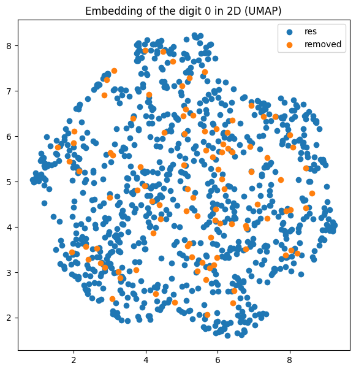
  发现程混合状，降维后导致几何特征消失？
  从剩余的数据和被去除的数据中选取部分样本，绘图如下：
  剩余的数据样本：
  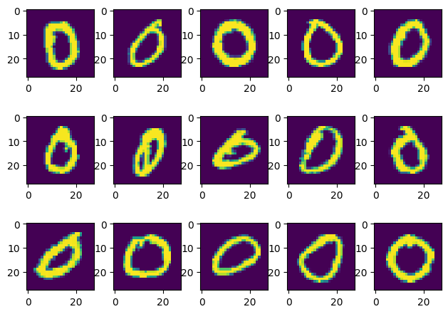
  被去除的数据样本：
  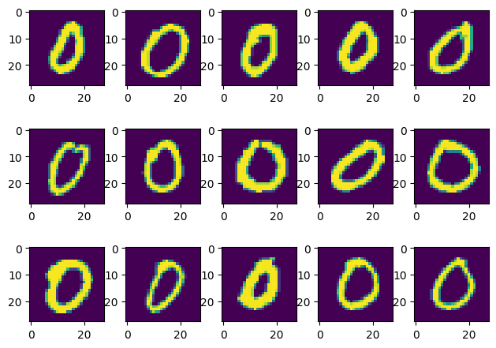
- 在 SwissRoll 人造小数据集上测试，下面是 aegr 最大的若干测地线路径，`test_all.py test_swissroll`：
  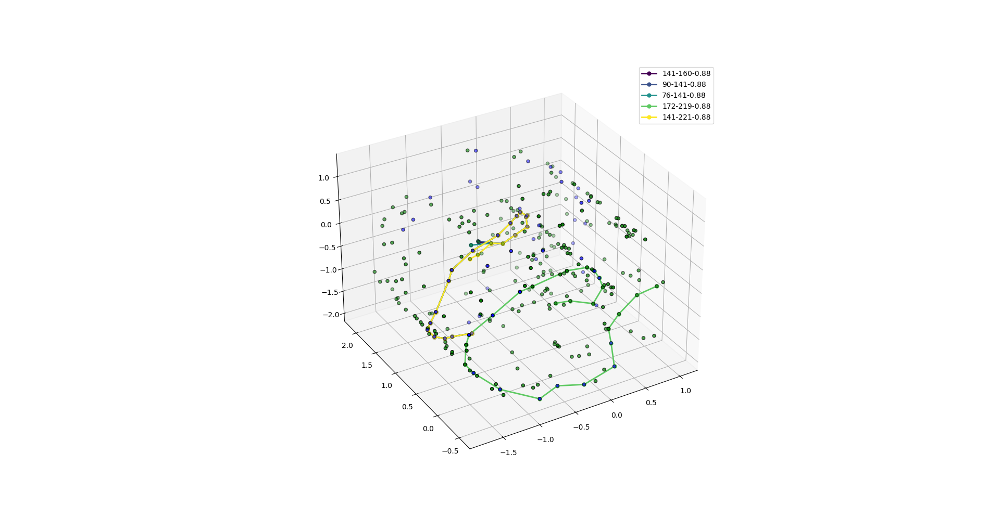
- 在 hhw_code 中 data_compress 时，目前尚未利用 udist 即单位结点对应的测地线距离长度，而路径越长，aegr越接近 1 ，导致偏差。
- **问题**：直接使用欧氏距离来评判两个样本是否“靠近”，无法反映出图片数据所具有的“平移不变性”，即两张相同的图片，其中一张略微位移一下，就会导致欧氏距离非常大。
  也就是说，“欧氏距离”无法反映图片数据的“空间信息” 。如果这样的话，基于“欧氏距离”的“数据集合特征”，就难以反映出数据的“语义”信息。
- 对 minst 0 的 geo feature 数据进行分析，绘制成柱状图：
  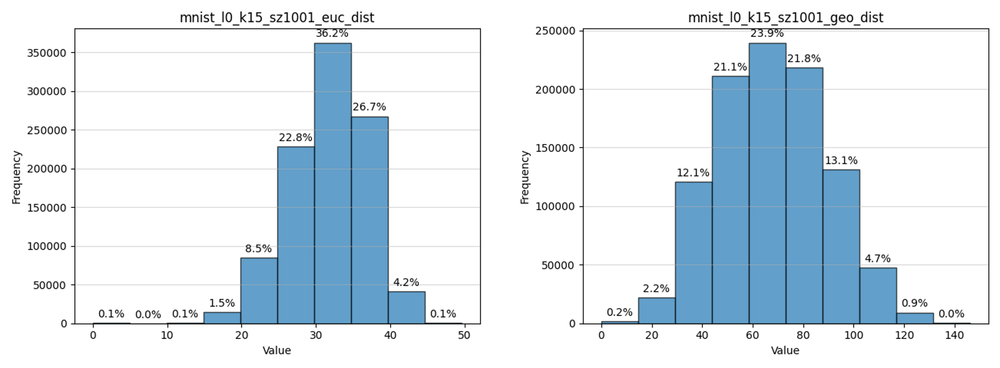
  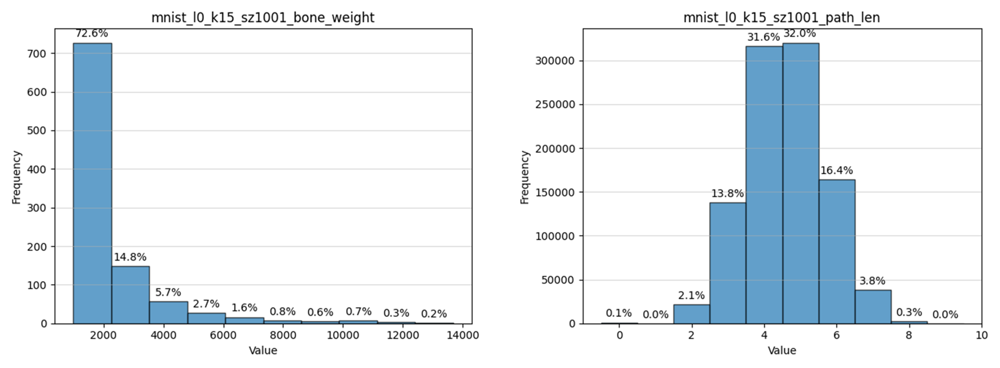
  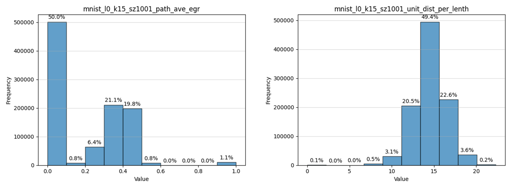
- TODO：对 swissroll 的geo feature 数据进行分析，绘制成柱状图：
  （初步发现欧几里得性质较好的 swissroll 数据，aegr 普遍接近于 1）
- UMAP 对 MNIST 进行降维可视化：`umap.ipynb`
  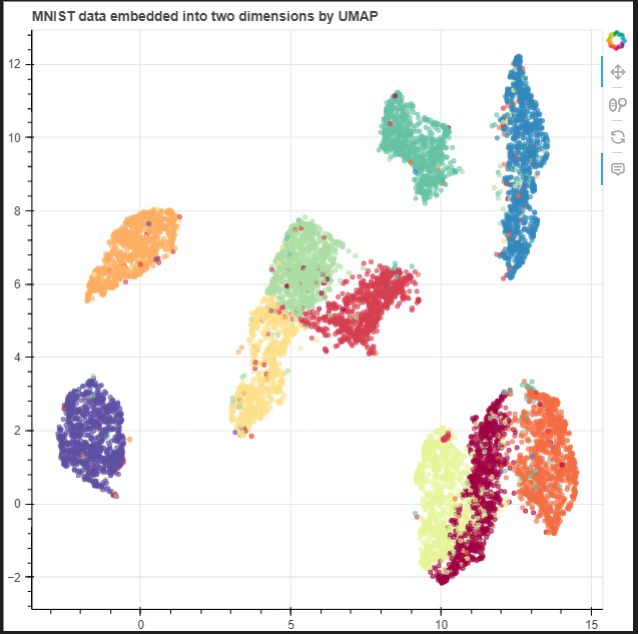
- 用压缩后的 MNIST 数据选出 1w 张进行分类测试，测试集为原 1w 测试数据，网络采用略修改的 LeNet，结果如下：

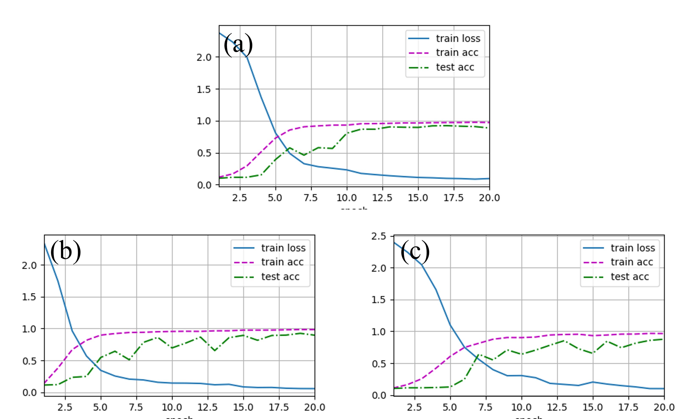

- - $(a)$：在 1w 数据上提取几何特征，做数据压缩，压缩率为 0.8， 然后在压缩后的数据上训练。
  - $(b)$：直接在 1w 数据上进行训练。
  - $(c)$：在 1w 数据上随机选出 0.8 * 1w 的数据进行训练。
  - 收敛更快、更稳定一些，test acc 后期更稳定，过拟合现象有所缓解。
  - 需要进一步地集中测试和分析。
- 感觉”几何特征“消耗大，效果并不显著，几何特征与语义无法找到很好的映射关系，不太好解释（；へ：）
